

**中文** · [English](https://github.com/shushuitie2017/shushuitie2017/blob/main/README.en.md) · [日本語](https://github.com/shushuitie2017/shushuitie2017/blob/main/README.ja.md)

# 蓝猫 · BlueCat

**我用 AI 高频量产真实的、已上线的产品。**

---

### 我在做的事

**产品全部由 AI 写就，我只负责想清楚要做什么。** 下面每一张都点得开、用得了，统一栖息在 [bluecatbot.com](https://bluecatbot.com)。

 

#### 🎮 游戏 & 3D

<table>
<tr>
<td width="50%"> <b>奇点竞速 · RACE TO ASI</b> 四大 AI 实验室竞速超级智能的 3D 即时战略</td>
<td width="50%"> <b>修仙 MMO</b> 浏览器修仙 MMORPG</td>
</tr>
<tr>
<td width="50%"> <b>酒田 · 四季之市</b> 交易心法视觉小说（本间宗久 · 米市）</td>
<td width="50%"> <b>河畔鲤鱼旗</b> VRM + 骨骼动画的 3D 放风筝场景</td>
</tr>
<tr>
<td width="50%"> <b>GameBox</b> 浏览器 3D 游戏积木，74 个即用 ESM 模块</td>
<td width="50%"> <b>墨鱼池 ink-pond</b> 水墨流体生成艺术</td>
</tr>
<tr>
<td width="50%"><a href="https://wow.bluecatbot.com">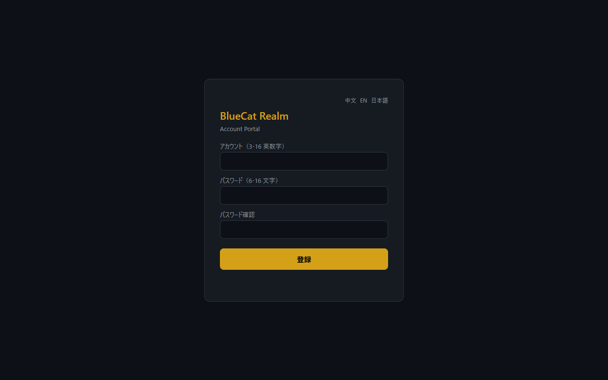</a> <b>魔兽世界私服</b> WoW 3.3.5a 私服 + 注册 / GM 管理台</td>
<td width="50%"><a href="https://shushuitie2017.github.io/diandian-cookie/">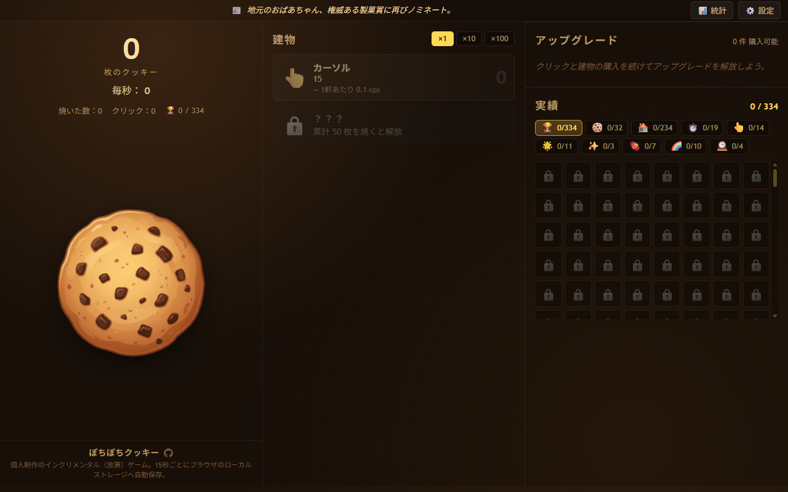</a> <b>点点饼干</b> 浏览器饼干放置游戏（Blazor WASM）</td>
</tr>
</table>

#### 🧊 3D 世界 & 可视化

<table>
<tr>
<td width="50%"><a href="https://hardware.bluecatbot.com">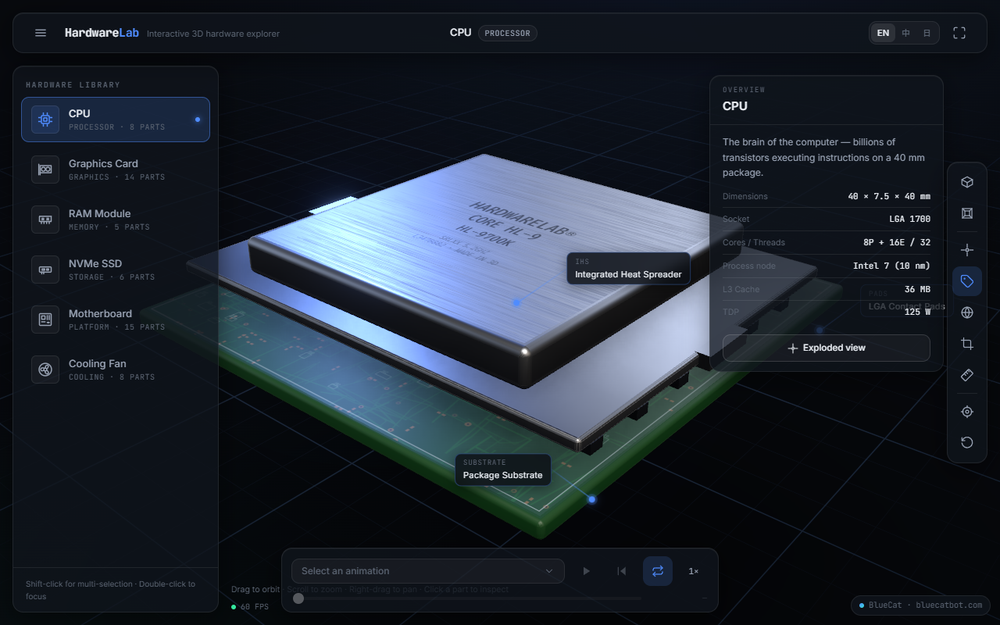</a> <b>HardwareLab</b> 浏览器里的 3D 硬件拆解实验室，爆炸视图 + 教学动画</td>
<td width="50%"><a href="https://keyboard.bluecatbot.com">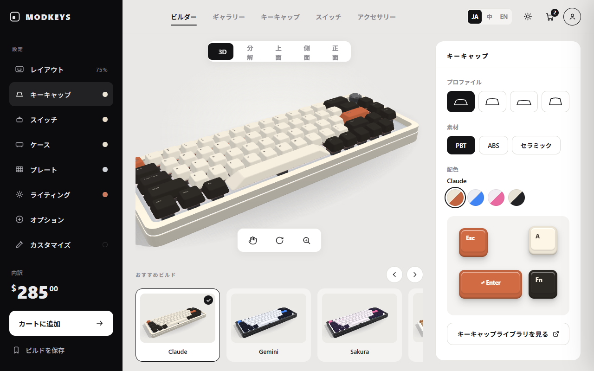</a> <b>MODKEYS 键盘</b> 3D 客制化键盘配置器，实时换轴换帽</td>
</tr>
<tr>
<td width="50%"><a href="https://gujian.bluecatbot.com">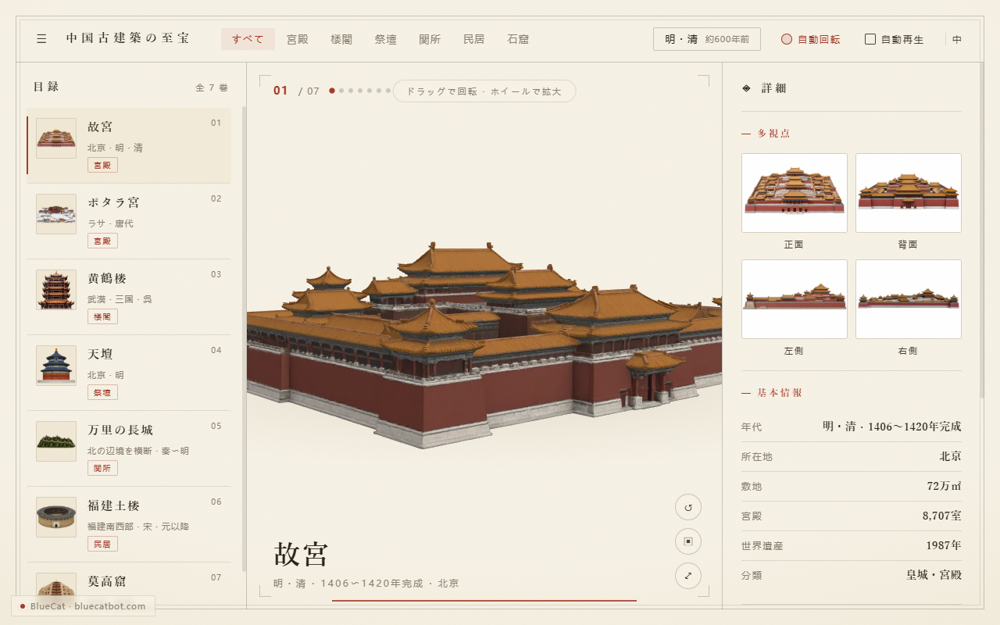</a> <b>中国古建筑</b> 3D 巡览 7 座中国古建筑名作</td>
<td width="50%"><a href="https://shushuitie2017.github.io/physics/">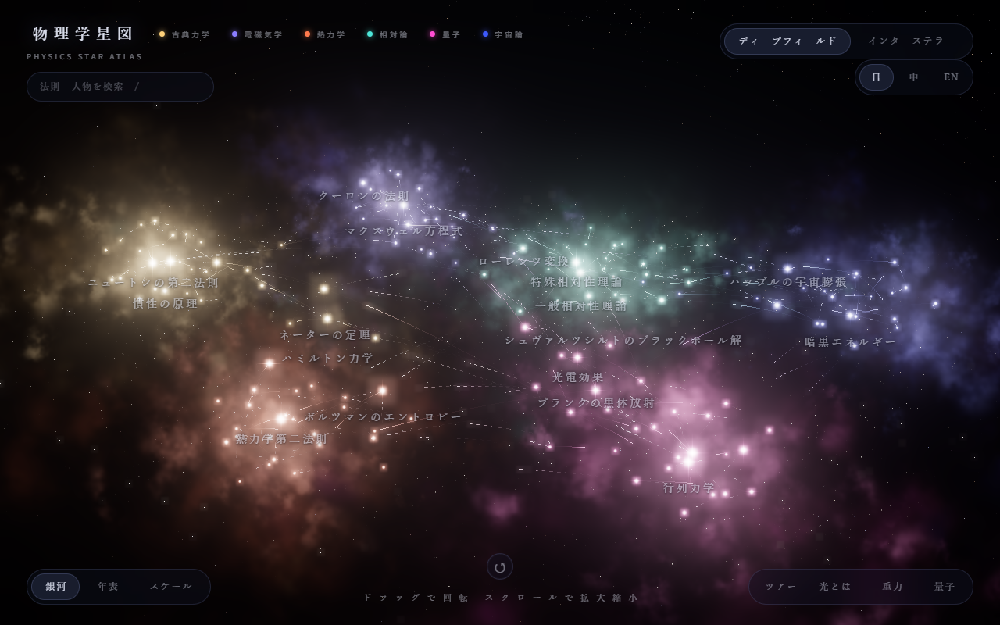</a> <b>物理学星图</b> 把物理学史做成一张可漫游的「知识星系」</td>
</tr>
<tr>
<td width="50%"><a href="https://shushuitie2017.github.io/structured/">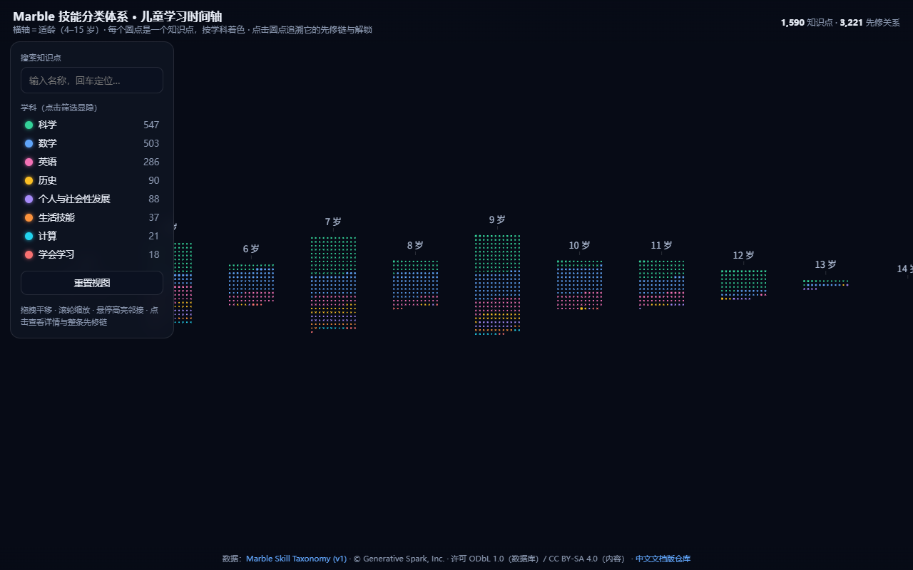</a> <b>结构化 · 学习时间轴</b> 1590 个儿童知识点按 4–15 岁排布 + 先修链追溯</td>
<td width="50%"><a href="https://shushuitie2017.github.io/toys/">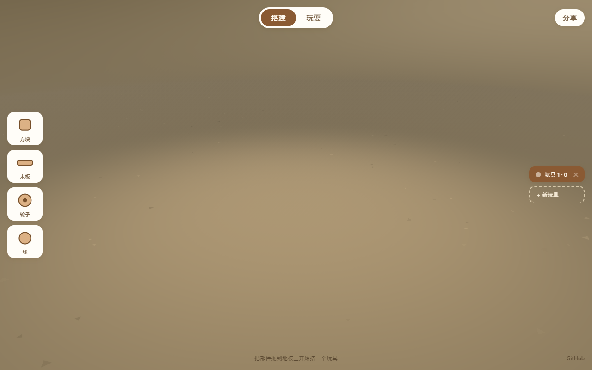</a> <b>玩具工坊 Toys</b> WebGPU 积木工坊：拼起来，让它转，看它活</td>
</tr>
<tr>
<td width="50%"><a href="https://shushuitie2017.github.io/bluecat-spider/">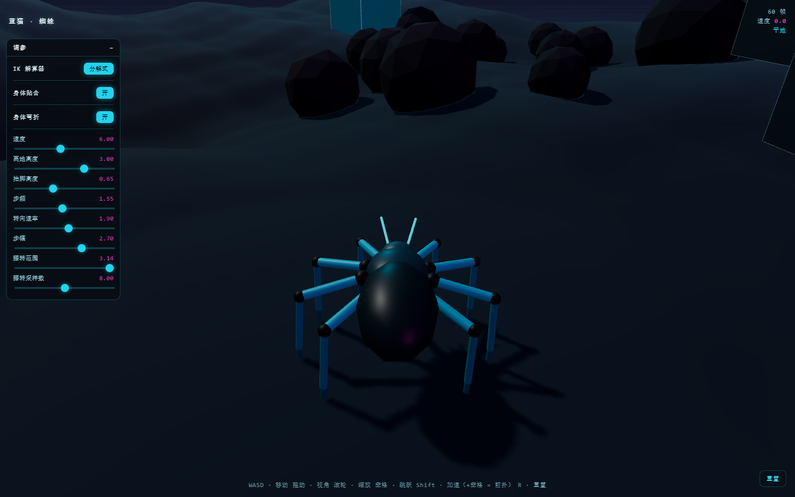</a> <b>蓝猫蜘蛛</b> 程序化 IK 步态的 WebGL 蜘蛛</td>
<td width="50%"></td>
</tr>
</table>

#### 🛠️ 工具

<table>
<tr>
<td width="50%"> <b>SVGSafe</b> 授权清晰的免费 SVG 图标/插画库，6000+ 张</td>
<td width="50%"> <b>SEO 体检</b> 在线 SEO 诊断 + 复制即用的修复片段</td>
</tr>
<tr>
<td width="50%"> <b>Mole 清理</b> 磁盘清理桌面工具官网</td>
<td width="50%"> <b>MarkItDown</b> 文档转 Markdown（PDF/DOCX/PPTX…）</td>
</tr>
<tr>
<td width="50%"> <b>Prompt Picker</b> AI 提示词挑选与管理</td>
<td width="50%"> <b>JLPT 汉字测试</b> 日语能力考试 · 汉字手写练习</td>
</tr>
<tr>
<td width="50%"> <b>My Nav 导航</b> 浏览历史分类导航站</td>
<td width="50%"><a href="https://threejsskills.bluecatbot.com">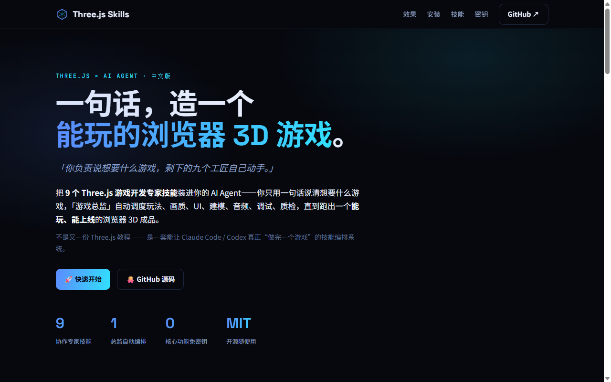</a> <b>Three.js Skills</b> 一句话造一个能玩的浏览器 3D 游戏（9 个技能包）</td>
</tr>
</table>

#### 📊 数据 & 交易

<table>
<tr>
<td width="50%"> <b>GitHub 趋势 · 人话榜</b> GitHub 趋势榜，用人话讲清每个热门项目</td>
<td width="50%"> <b>Comment Ranking</b> 跨平台评论聚合 · 排名 · 监控</td>
</tr>
<tr>
<td width="50%"> <b>TradingAgents</b> 12 个 AI 智能体协作，产出一份交易研判</td>
<td width="50%"> <b>Polymarket Monitor</b> 加密短线行情监控与策略看板</td>
</tr>
<tr>
<td width="50%"> <b>Cat News</b> 实时热点聚合</td>
<td width="50%"><a href="https://susuonepiece.com/signal/">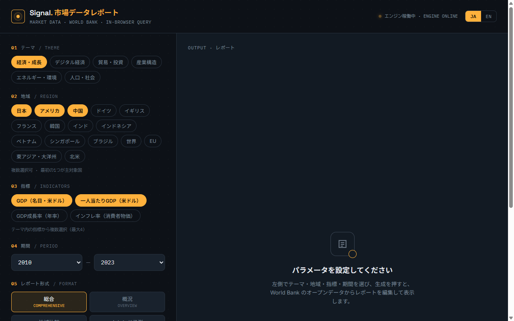</a> <b>Signal 市场数据</b> 浏览器内查询世界银行数据（DuckDB-WASM）</td>
</tr>
</table>

#### 📥 下载器

<table>
<tr>
<td width="50%"> <b>Bili-Downloader</b> Bilibili 视频下载器</td>
<td width="50%"> <b>TikTok Downloader</b> TikTok 短视频下载器</td>
</tr>
</table>

#### 📚 内容 & 文化

<table>
<tr>
<td width="50%"> <b>三语博客 vlog</b> 中英日博客 + 每日自动发文流水线</td>
<td width="50%"> <b>古籍阅览 oldbook</b> 三语古籍影印 + 翻刻 + 译注</td>
</tr>
<tr>
<td width="50%"> <b>玄机 XUANJI</b> 古籍蒸馏的占卜 / 解梦 / 易占</td>
<td width="50%"> <b>天涯论坛复刻</b> 复刻盖楼式论坛，归档 8 万楼神贴</td>
</tr>
<tr>
<td width="50%"> <b>蓝猫学 Claude</b> 儿童学 Claude 互动课本</td>
<td width="50%"> <b>蓝猫 3D</b> AI × 3D 角色产线的工具榜单与实战课</td>
</tr>
</table>

#### 🗂️ 效率 & 私域

<table>
<tr>
<td width="50%"> <b>NoteBank</b> 卡片式知识管理</td>
<td width="50%"> <b>精选文章</b> 精选公众号文章，一站式阅读</td>
</tr>
<tr>
<td width="50%"> <b>AdVidGen</b> 用 AI 生成专业级视频，可视化工作流</td>
<td width="50%"> <b>WeChat Exporter</b> 公众号文章导出 / 归档</td>
</tr>
<tr>
<td width="50%"> <b>语脉 CRM</b> 销售跟进管理后台</td>
<td width="50%"><a href="https://mimamori.bluecatbot.com">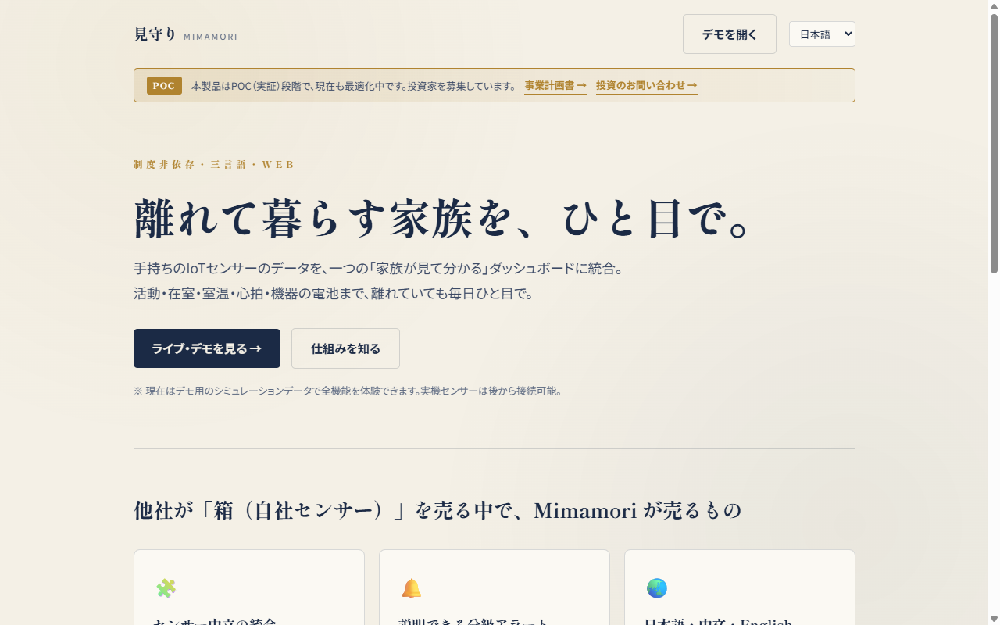</a> <b>见守り Mimamori</b> 离家家人一目了然的多语言看护仪表盘</td>
</tr>
</table>

---

### 我相信的几件事

**做出来比说出来有用。** 我不写「AI 可能会怎样」，只放「我用 AI 做出了什么」——每一个链接都点得开。

**稀缺的是判断力，不是生成。** AI 能写无限的代码，知道该做什么、做成什么样，仍然得靠人。

**一人，全栈，三语。** 从 3D 引擎到支付到部署，从中文到日文到英文，一个人 + AI 就能端到端交付。

---

### 找到我

 
👆 微信 · 交流 / 合作

**主站** — [bluecatbot.com](https://bluecatbot.com) · **GitHub** — [@shushuitie2017](https://github.com/shushuitie2017)

